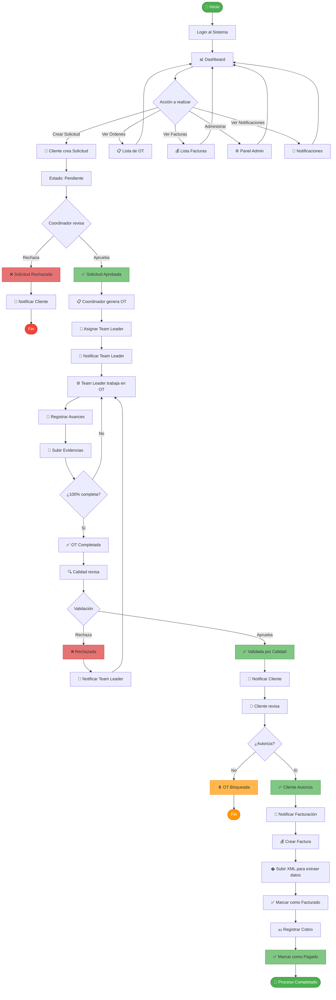
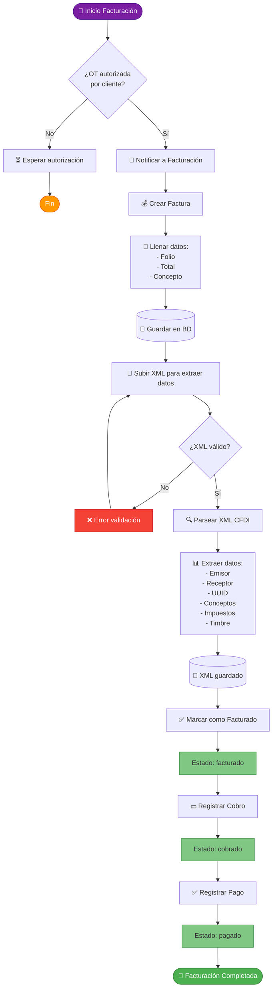
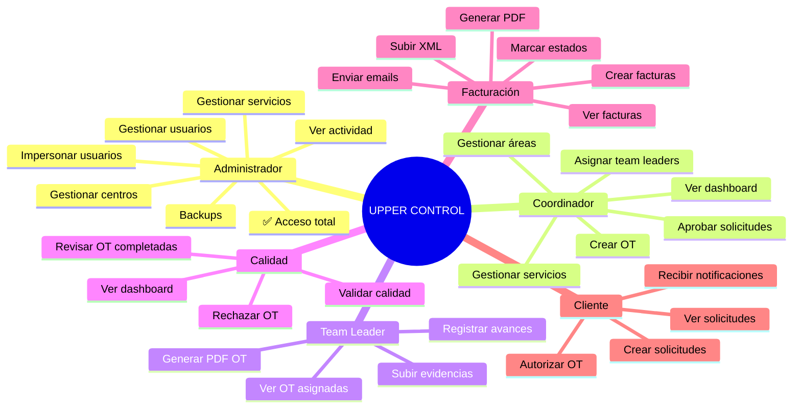

# Diagramas del Sistema UPPER_CONTROL

Sistema de gestión de órdenes de trabajo y facturación para control de calidad.

---

## 📋 Diagrama de Casos de Uso

```mermaid
graph TB
    %% Actores
    Cliente([👤 Cliente])
    Coordinador([👤 Coordinador])
    TeamLeader([👤 Team Leader])
    Calidad([👤 Calidad])
    Facturacion([👤 Facturación])
    Admin([👤 Administrador])

    %% Módulo de Solicitudes
    subgraph Solicitudes[📝 Módulo de Solicitudes]
        UC1[Crear Solicitud]
        UC2[Ver Solicitudes]
        UC3[Aprobar Solicitud]
        UC4[Rechazar Solicitud]
    end

    %% Módulo de Órdenes de Trabajo
    subgraph Ordenes[📋 Módulo de Órdenes]
        UC5[Generar OT desde Solicitud]
        UC6[Asignar Team Leader]
        UC7[Registrar Avances]
        UC8[Subir Evidencias]
        UC9[Ver OT]
        UC10[Generar PDF OT]
    end

    %% Módulo de Calidad
    subgraph ModCalidad[✅ Módulo de Calidad]
        UC11[Revisar OT Completadas]
        UC12[Validar Calidad]
        UC13[Rechazar por Calidad]
    end

    %% Módulo de Cliente
    subgraph ModCliente[👥 Validación Cliente]
        UC14[Revisar OT Validada]
        UC15[Autorizar OT]
    end

    %% Módulo de Facturación
    subgraph ModFacturacion[💰 Módulo de Facturación]
        UC16[Ver Facturas]
        UC17[Crear Factura desde OT]
        UC18[Subir XML Factura]
        UC19[Marcar como Facturado]
        UC20[Marcar Cobro]
        UC21[Marcar Pagado]
        UC22[Generar PDF Factura]
        UC23[Enviar Factura por Email]
    end

    %% Módulo de Administración
    subgraph ModAdmin[⚙️ Módulo de Administración]
        UC24[Gestionar Usuarios]
        UC25[Gestionar Centros de Trabajo]
        UC26[Gestionar Servicios/Precios]
        UC27[Gestionar Áreas]
        UC28[Ver Actividad del Sistema]
        UC29[Hacer Backups]
        UC30[Impersonar Usuarios]
    end

    %% Módulo de Dashboard
    subgraph ModDashboard[📊 Dashboard & Reportes]
        UC31[Ver Dashboard]
        UC32[Exportar OTs a Excel]
        UC33[Exportar Facturas a Excel]
        UC34[Ver Notificaciones]
    end

    %% Relaciones Cliente
    Cliente --> UC1
    Cliente --> UC2
    Cliente --> UC14
    Cliente --> UC15

    %% Relaciones Coordinador
    Coordinador --> UC2
    Coordinador --> UC3
    Coordinador --> UC4
    Coordinador --> UC5
    Coordinador --> UC6
    Coordinador --> UC9
    Coordinador --> UC26
    Coordinador --> UC27
    Coordinador --> UC31

    %% Relaciones Team Leader
    TeamLeader --> UC7
    TeamLeader --> UC8
    TeamLeader --> UC9
    TeamLeader --> UC10

    %% Relaciones Calidad
    Calidad --> UC11
    Calidad --> UC12
    Calidad --> UC13
    Calidad --> UC31

    %% Relaciones Facturación
    Facturacion --> UC16
    Facturacion --> UC17
    Facturacion --> UC18
    Facturacion --> UC19
    Facturacion --> UC20
    Facturacion --> UC21
    Facturacion --> UC22
    Facturacion --> UC23
    Facturacion --> UC31

    %% Relaciones Administrador (acceso total)
    Admin --> UC24
    Admin --> UC25
    Admin --> UC26
    Admin --> UC27
    Admin --> UC28
    Admin --> UC29
    Admin --> UC30
    Admin --> UC31
    Admin --> UC32
    Admin --> UC33
    Admin --> UC3
    Admin --> UC4
    Admin --> UC5
    Admin --> UC12
    Admin --> UC13
    Admin --> UC16
    Admin --> UC17
    Admin --> UC18
    Admin --> UC19
    Admin --> UC20
    Admin --> UC21

    %% Todos ven notificaciones y dashboard básico
    Cliente --> UC34
    Coordinador --> UC34
    TeamLeader --> UC34
    Calidad --> UC34
    Facturacion --> UC34
    Admin --> UC34

    style Solicitudes fill:#e3f2fd,stroke:#1976d2
    style Ordenes fill:#fff3e0,stroke:#f57c00
    style ModCalidad fill:#e8f5e9,stroke:#388e3c
    style ModCliente fill:#fce4ec,stroke:#c2185b
    style ModFacturacion fill:#f3e5f5,stroke:#7b1fa2
    style ModAdmin fill:#ffebee,stroke:#d32f2f
    style ModDashboard fill:#e0f2f1,stroke:#00796b
```

---

## 🔄 Diagrama de Flujo Principal del Sistema

---

## 💰 Diagrama de Flujo de Facturación (Detallado - Solo Procesos del Sistema)

---

## 📊 Diagrama de Estados de Orden de Trabajo

---

## 🔐 Diagrama de Roles y Permisos

---

## 📧 Diagrama de Flujo de Notificaciones

---

## 🗂️ Diagrama de Base de Datos (Principales Relaciones)

---

## 📱 Tecnologías Utilizadas

---

## 📋 Leyenda de Estados

### Estados de Solicitud
- 🟡 **pendiente**: Esperando revisión del coordinador
- 🟢 **aprobada**: Aprobada, lista para generar OT
- 🔴 **rechazada**: Rechazada por coordinador

### Estados de Orden de Trabajo
- ⚪ **nueva**: Recién creada, sin asignar
- 🔵 **asignada**: Asignada a Team Leader
- 🟡 **en_progreso**: Team Leader trabajando
- 🟣 **completada**: 100% progreso, esperando calidad
- 🟢 **validada_calidad**: Aprobada por calidad
- 🔴 **rechazada_calidad**: Rechazada por calidad
- 🟢 **validada_cliente**: Autorizada por cliente
- 🔴 **bloqueada**: Cliente no autorizó
- 💰 **facturada**: Ya tiene factura asociada

### Estados de Factura
- 🟡 **pendiente**: Creada, esperando timbrado
- 🟢 **facturado**: XML subido y timbrada
- 💵 **cobrado**: Cobro registrado
- ✅ **pagado**: Pago completado

---

## 🚀 Comandos Artisan Personalizados

---

## 📝 Notas de Implementación

### Características Principales
- ✅ **Sistema de roles**: Spatie Laravel Permission
- ✅ **Notificaciones**: Database + Mail
- ✅ **PDFs**: Laravel Dompdf con datos XML CFDI
- ✅ **QR**: Código QR SAT para verificación
- ✅ **Email**: Notificaciones con adjuntos PDF
- ✅ **Backups**: Sistema automático de respaldos
- ✅ **Activity Log**: Registro de actividad de usuarios
- ✅ **Impersonación**: Admin puede impersonar usuarios
- ✅ **Exports**: Excel para OTs y Facturas
- ✅ **Recordatorios**: Sistema automatizado de recordatorios

### Últimas Mejoras Implementadas
1. **PDF de Facturas con XML**: Extracción completa de datos CFDI 3.3/4.0
2. **Código QR SAT**: Generación automática con fallback SVG
3. **Email con PDF**: Notificación al cliente con factura adjunta
4. **Animación de Carga**: Banda transportadora con cajas centradas

---

## 🔗 Cómo usar estos diagramas

Estos diagramas están en formato **Mermaid** y pueden ser visualizados en:

1. **GitHub/GitLab**: Se renderizan automáticamente
2. **VS Code**: Con extensión "Markdown Preview Mermaid Support"
3. **Mermaid Live Editor**: https://mermaid.live/
4. **Confluence/Notion**: Soportan Mermaid nativamente
5. **Exportar a PNG/SVG**: Usando Mermaid CLI o el editor online

---

**Fecha de creación**: 14 de octubre de 2025  
**Sistema**: UPPER_CONTROL v1.0  
**Framework**: Laravel 12.26.4  
**Autor**: Generado automáticamente del análisis del código
