# Diagramas del Sistema UPPER_CONTROL

Sistema de gestión de órdenes de trabajo y facturación para control de calidad.

---

## 📋 Diagrama de Casos de Uso

```mermaid
graph TB
    %% Actores
    Cliente([👤 Cliente])
    Coordinador([👤 Coordinador])
    TecnicoLider([👤 Técnico Líder])
    Calidad([👤 Calidad])
    Facturacion([👤 Facturación])
    Admin([👤 Administrador])

    %% Módulo de Solicitudes
    subgraph Solicitudes[📝 Módulo de Solicitudes]
        UC1[Crear Solicitud]
        UC2[Ver Solicitudes]
        UC3[Aprobar Solicitud]
        UC4[Rechazar Solicitud]
    end

    %% Módulo de Órdenes de Trabajo
    subgraph Ordenes[📋 Módulo de Órdenes]
        UC5[Generar OT desde Solicitud]
        UC6[Asignar Técnico Líder]
        UC7[Registrar Avances]
        UC8[Subir Evidencias]
        UC9[Ver OT]
        UC10[Generar PDF OT]
    end

    %% Módulo de Calidad
    subgraph ModCalidad[✅ Módulo de Calidad]
        UC11[Revisar OT Completadas]
        UC12[Validar Calidad]
        UC13[Rechazar por Calidad]
    end

    %% Módulo de Cliente
    subgraph ModCliente[👥 Validación Cliente]
        UC14[Revisar OT Validada]
        UC15[Autorizar OT]
    end

    %% Módulo de Facturación
    subgraph ModFacturacion[💰 Módulo de Facturación]
        UC16[Ver Facturas]
        UC17[Crear Factura desde OT]
        UC18[Subir XML Factura]
        UC19[Marcar como Facturado]
        UC20[Marcar Cobro]
        UC21[Marcar Pagado]
        UC22[Generar PDF Factura]
        UC23[Enviar Factura por Email]
    end

    %% Módulo de Administración
    subgraph ModAdmin[⚙️ Módulo de Administración]
        UC24[Gestionar Usuarios]
        UC25[Gestionar Centros de Trabajo]
        UC26[Gestionar Servicios/Precios]
        UC27[Gestionar Áreas]
        UC28[Ver Actividad del Sistema]
        UC29[Hacer Backups]
        UC30[Impersonar Usuarios]
    end

    %% Módulo de Dashboard
    subgraph ModDashboard[📊 Dashboard & Reportes]
        UC31[Ver Dashboard]
        UC32[Exportar OTs a Excel]
        UC33[Exportar Facturas a Excel]
        UC34[Ver Notificaciones]
    end

    %% Relaciones Cliente
    Cliente --> UC1
    Cliente --> UC2
    Cliente --> UC14
    Cliente --> UC15

    %% Relaciones Coordinador
    Coordinador --> UC2
    Coordinador --> UC3
    Coordinador --> UC4
    Coordinador --> UC5
    Coordinador --> UC6
    Coordinador --> UC9
    Coordinador --> UC26
    Coordinador --> UC27
    Coordinador --> UC31

    %% Relaciones Técnico Líder
    TecnicoLider --> UC7
    TecnicoLider --> UC8
    TecnicoLider --> UC9
    TecnicoLider --> UC10

    %% Relaciones Calidad
    Calidad --> UC11
    Calidad --> UC12
    Calidad --> UC13
    Calidad --> UC31

    %% Relaciones Facturación
    Facturacion --> UC16
    Facturacion --> UC17
    Facturacion --> UC18
    Facturacion --> UC19
    Facturacion --> UC20
    Facturacion --> UC21
    Facturacion --> UC22
    Facturacion --> UC23
    Facturacion --> UC31

    %% Relaciones Administrador (acceso total)
    Admin --> UC24
    Admin --> UC25
    Admin --> UC26
    Admin --> UC27
    Admin --> UC28
    Admin --> UC29
    Admin --> UC30
    Admin --> UC31
    Admin --> UC32
    Admin --> UC33
    Admin --> UC3
    Admin --> UC4
    Admin --> UC5
    Admin --> UC12
    Admin --> UC13
    Admin --> UC16
    Admin --> UC17
    Admin --> UC18
    Admin --> UC19
    Admin --> UC20
    Admin --> UC21

    %% Todos ven notificaciones y dashboard básico
    Cliente --> UC34
    Coordinador --> UC34
    TecnicoLider --> UC34
    Calidad --> UC34
    Facturacion --> UC34
    Admin --> UC34

    style Solicitudes fill:#e3f2fd,stroke:#1976d2
    style Ordenes fill:#fff3e0,stroke:#f57c00
    style ModCalidad fill:#e8f5e9,stroke:#388e3c
    style ModCliente fill:#fce4ec,stroke:#c2185b
    style ModFacturacion fill:#f3e5f5,stroke:#7b1fa2
    style ModAdmin fill:#ffebee,stroke:#d32f2f
    style ModDashboard fill:#e0f2f1,stroke:#00796b
```

---

## 🔄 Diagrama de Flujo Principal del Sistema

```mermaid
flowchart TD
    Start([🚀 Inicio]) --> Login[Login al Sistema]
    Login --> Dashboard[📊 Dashboard]
    
    Dashboard --> Decision1{Acción a realizar}
    
    %% Flujo de Solicitudes
    Decision1 -->|Crear Solicitud| SolCreate[📝 Cliente crea Solicitud]
    SolCreate --> SolPendiente[Estado: Pendiente]
    SolPendiente --> SolRevision{Coordinador revisa}
    SolRevision -->|Aprueba| SolAprobada[✅ Solicitud Aprobada]
    SolRevision -->|Rechaza| SolRechazada[❌ Solicitud Rechazada]
    SolRechazada --> NotifCliente1[📧 Notificar Cliente]
    NotifCliente1 --> End1([Fin])
    
    %% Flujo de OT
    SolAprobada --> OTCrear[📋 Coordinador genera OT]
    OTCrear --> OTAsignar[👤 Asignar Técnico Líder]
    OTAsignar --> NotifTL[📧 Notificar Técnico]
    NotifTL --> OTProgreso[⚙️ Técnico trabaja en OT]
    
    OTProgreso --> OTAvances[📝 Registrar Avances]
    OTAvances --> OTEvidencias[📸 Subir Evidencias]
    OTEvidencias --> OTCheck{¿100% completa?}
    OTCheck -->|No| OTProgreso
    OTCheck -->|Sí| OTCompletada[✅ OT Completada]
    
    %% Flujo de Calidad
    OTCompletada --> CalidadRevision[🔍 Calidad revisa]
    CalidadRevision --> CalidadDecision{Validación}
    CalidadDecision -->|Rechaza| OTRechazadaCalidad[❌ Rechazada]
    OTRechazadaCalidad --> NotifTL2[📧 Notificar Técnico]
    NotifTL2 --> OTProgreso
    
    CalidadDecision -->|Aprueba| OTValidada[✅ Validada por Calidad]
    OTValidada --> NotifCliente2[📧 Notificar Cliente]
    
    %% Flujo de Autorización Cliente
    NotifCliente2 --> ClienteRevision[👤 Cliente revisa]
    ClienteRevision --> ClienteDecision{¿Autoriza?}
    ClienteDecision -->|No| Bloqueada[⏸️ OT Bloqueada]
    Bloqueada --> End2([Fin])
    
    ClienteDecision -->|Sí| ClienteAutoriza[✅ Cliente Autoriza]
    ClienteAutoriza --> NotifFacturacion[📧 Notificar Facturación]
    
    %% Flujo de Facturación
    NotifFacturacion --> FacturaCrear[💰 Crear Factura]
    FacturaCrear --> FacturaGenPDF[📄 Generar PDF con XML]
    FacturaGenPDF --> FacturaGenQR[🔲 Generar QR SAT]
    FacturaGenQR --> FacturaEmail[📧 Enviar PDF a Cliente]
    
    FacturaEmail --> FacturaXML[📎 Subir XML Factura]
    FacturaXML --> FacturaFacturado[✅ Marcar Facturado]
    FacturaFacturado --> FacturaCobro[💵 Registrar Cobro]
    FacturaCobro --> FacturaPagado[✅ Marcar Pagado]
    
    FacturaPagado --> End3([🎉 Proceso Completado])
    
    %% Otros flujos desde Dashboard
    Decision1 -->|Ver Órdenes| ListaOT[📋 Lista de OT]
    Decision1 -->|Ver Facturas| ListaFacturas[💰 Lista Facturas]
    Decision1 -->|Administrar| AdminPanel[⚙️ Panel Admin]
    Decision1 -->|Ver Notificaciones| Notificaciones[🔔 Notificaciones]
    
    ListaOT --> Dashboard
    ListaFacturas --> Dashboard
    AdminPanel --> Dashboard
    Notificaciones --> Dashboard
    
    style Start fill:#4caf50,stroke:#2e7d32,color:#fff
    style End1 fill:#f44336,stroke:#c62828,color:#fff
    style End2 fill:#ff9800,stroke:#e65100,color:#fff
    style End3 fill:#4caf50,stroke:#2e7d32,color:#fff
    style SolAprobada fill:#81c784,stroke:#388e3c
    style OTValidada fill:#81c784,stroke:#388e3c
    style ClienteAutoriza fill:#81c784,stroke:#388e3c
    style FacturaPagado fill:#81c784,stroke:#388e3c
    style SolRechazada fill:#e57373,stroke:#d32f2f
    style OTRechazadaCalidad fill:#e57373,stroke:#d32f2f
    style Bloqueada fill:#ffb74d,stroke:#f57c00
```

---

## 💰 Diagrama de Flujo de Facturación (Detallado)

```mermaid
flowchart TD
    Start([🚀 Inicio Facturación]) --> Check{¿OT autorizada<br/>por cliente?}
    Check -->|No| Wait[⏳ Esperar autorización]
    Wait --> End1([Fin])
    
    Check -->|Sí| CreateFactura[💰 Crear Factura]
    CreateFactura --> FillData[📝 Llenar datos:<br/>- Folio<br/>- Total<br/>- Concepto]
    
    FillData --> GuardarDB[(💾 Guardar en BD)]
    GuardarDB --> JobPDF[⚙️ Job: GenerateFacturaPdf]
    
    JobPDF --> LoadData[📥 Cargar datos:<br/>- Factura<br/>- Orden<br/>- Cliente]
    LoadData --> ParseXML[🔍 Parsear XML CFDI]
    
    ParseXML --> ExtractData[📊 Extraer datos:<br/>- Emisor<br/>- Receptor<br/>- UUID<br/>- Conceptos<br/>- Impuestos<br/>- Timbre]
    
    ExtractData --> GenQR[🔲 Generar QR SAT]
    GenQR --> QRFormat{Formato QR}
    QRFormat -->|PNG disponible| QRPng[Generar PNG]
    QRFormat -->|No imagick| QRSvg[Generar SVG]
    
    QRPng --> BuildPDF[📄 Construir PDF]
    QRSvg --> BuildPDF
    
    BuildPDF --> PDFContent[📝 PDF incluye:<br/>- Datos XML<br/>- QR verificación<br/>- Conceptos<br/>- Totales]
    
    PDFContent --> SavePDF[(💾 Guardar PDF)]
    SavePDF --> CheckNotify{¿Notificar<br/>cliente?}
    
    CheckNotify -->|No| End2([Fin])
    CheckNotify -->|Sí| SendEmail[📧 Enviar Email]
    
    SendEmail --> AttachPDF[📎 Adjuntar PDF]
    AttachPDF --> EmailSent[✅ Email enviado]
    EmailSent --> EmailContent[💌 Email contiene:<br/>- Datos factura<br/>- Link ver factura<br/>- PDF adjunto]
    
    EmailContent --> ClienteRecibe[👤 Cliente recibe]
    
    ClienteRecibe --> UploadXML[📎 Facturación sube XML]
    UploadXML --> ValidateXML{¿XML válido?}
    ValidateXML -->|No| ErrorXML[❌ Error validación]
    ErrorXML --> UploadXML
    
    ValidateXML -->|Sí| XMLSaved[(💾 XML guardado)]
    XMLSaved --> MarcarFacturado[✅ Marcar Facturado]
    
    MarcarFacturado --> Status1[Estado: facturado]
    Status1 --> RegCobro[💵 Registrar Cobro]
    RegCobro --> Status2[Estado: cobrado]
    
    Status2 --> RegPago[✅ Registrar Pago]
    RegPago --> Status3[Estado: pagado]
    
    Status3 --> Complete([🎉 Facturación Completada])
    
    style Start fill:#7b1fa2,stroke:#4a148c,color:#fff
    style Complete fill:#4caf50,stroke:#2e7d32,color:#fff
    style End1 fill:#ff9800,stroke:#e65100,color:#fff
    style End2 fill:#2196f3,stroke:#1565c0,color:#fff
    style JobPDF fill:#03a9f4,stroke:#01579b,color:#fff
    style BuildPDF fill:#ff9800,stroke:#e65100,color:#fff
    style SendEmail fill:#4caf50,stroke:#2e7d32,color:#fff
    style ErrorXML fill:#f44336,stroke:#c62828,color:#fff
    style Status1 fill:#81c784,stroke:#388e3c
    style Status2 fill:#81c784,stroke:#388e3c
    style Status3 fill:#81c784,stroke:#388e3c
```

---

## 📊 Diagrama de Estados de Orden de Trabajo

---

## 🔐 Diagrama de Roles y Permisos

```mermaid
mindmap
  root((UPPER CONTROL))
    Administrador
      ✅ Acceso total
      Gestionar usuarios
      Gestionar centros
      Gestionar servicios
      Ver actividad
      Backups
      Impersonar usuarios
    Coordinador
      Aprobar solicitudes
      Crear OT
      Asignar técnicos
      Gestionar servicios
      Gestionar áreas
      Ver dashboard
    Técnico Líder
      Ver OT asignadas
      Registrar avances
      Subir evidencias
      Generar PDF OT
    Calidad
      Revisar OT completadas
      Validar calidad
      Rechazar OT
      Ver dashboard
    Facturación
      Ver facturas
      Crear facturas
      Subir XML
      Marcar estados
      Generar PDF
      Enviar emails
    Cliente
      Crear solicitudes
      Ver solicitudes
      Autorizar OT
      Recibir notificaciones
```

---

## 📧 Diagrama de Flujo de Notificaciones

```mermaid
sequenceDiagram
    participant Sistema
    participant Job
    participant Notification
    participant BD
    participant Email
    participant Usuario

    Sistema->>Job: Evento del sistema
    Job->>Notification: Crear notificación
    
    Notification->>BD: Guardar en tabla notifications
    Notification->>Email: Enviar email (si aplica)
    
    Email-->>Usuario: 📧 Correo electrónico
    
    Usuario->>Sistema: Accede al sistema
    Sistema->>BD: Consultar notificaciones
    BD-->>Sistema: Listado notificaciones
    Sistema->>Usuario: Mostrar campana 🔔
    
    Usuario->>Sistema: Click en notificación
    Sistema->>BD: Marcar como leída
    Sistema->>Usuario: Redirigir a recurso
    
    Note over Sistema,Usuario: Tipos de notificaciones:<br/>- OT Asignada<br/>- OT Lista para Calidad<br/>- OT Validada para Cliente<br/>- Cliente Autorizó<br/>- Factura Generada<br/>- Sistema (eventos varios)
```

---

## 🗂️ Diagrama de Base de Datos (Principales Relaciones)

---

## 📱 Tecnologías Utilizadas

---

## 📋 Leyenda de Estados

### Estados de Solicitud
- 🟡 **pendiente**: Esperando revisión del coordinador
- 🟢 **aprobada**: Aprobada, lista para generar OT
- 🔴 **rechazada**: Rechazada por coordinador

### Estados de Orden de Trabajo
- ⚪ **nueva**: Recién creada, sin asignar
- 🔵 **asignada**: Asignada a técnico líder
- 🟡 **en_progreso**: Técnico trabajando
- 🟣 **completada**: 100% progreso, esperando calidad
- 🟢 **validada_calidad**: Aprobada por calidad
- 🔴 **rechazada_calidad**: Rechazada por calidad
- 🟢 **validada_cliente**: Autorizada por cliente
- 🔴 **bloqueada**: Cliente no autorizó
- 💰 **facturada**: Ya tiene factura asociada

### Estados de Factura
- 🟡 **pendiente**: Creada, esperando timbrado
- 🟢 **facturado**: XML subido y timbrada
- 💵 **cobrado**: Cobro registrado
- ✅ **pagado**: Pago completado

---

## 🚀 Comandos Artisan Personalizados

---

## 📝 Notas de Implementación

### Características Principales
- ✅ **Sistema de roles**: Spatie Laravel Permission
- ✅ **Notificaciones**: Database + Mail
- ✅ **PDFs**: Laravel Dompdf con datos XML CFDI
- ✅ **QR**: Código QR SAT para verificación
- ✅ **Email**: Notificaciones con adjuntos PDF
- ✅ **Backups**: Sistema automático de respaldos
- ✅ **Activity Log**: Registro de actividad de usuarios
- ✅ **Impersonación**: Admin puede impersonar usuarios
- ✅ **Exports**: Excel para OTs y Facturas
- ✅ **Recordatorios**: Sistema automatizado de recordatorios

### Últimas Mejoras Implementadas
1. **PDF de Facturas con XML**: Extracción completa de datos CFDI 3.3/4.0
2. **Código QR SAT**: Generación automática con fallback SVG
3. **Email con PDF**: Notificación al cliente con factura adjunta
4. **Animación de Carga**: Banda transportadora con cajas centradas

---

## 🔗 Cómo usar estos diagramas

Estos diagramas están en formato **Mermaid** y pueden ser visualizados en:

1. **GitHub/GitLab**: Se renderizan automáticamente
2. **VS Code**: Con extensión "Markdown Preview Mermaid Support"
3. **Mermaid Live Editor**: https://mermaid.live/
4. **Confluence/Notion**: Soportan Mermaid nativamente
5. **Exportar a PNG/SVG**: Usando Mermaid CLI o el editor online

---

**Fecha de creación**: 14 de octubre de 2025  
**Sistema**: UPPER_CONTROL v1.0  
**Framework**: Laravel 12.26.4  
**Autor**: Generado automáticamente del análisis del código
