# Diagramas de Secuencia - UPPER_CONTROL

Diagramas de secuencia detallados de los casos de uso principales del sistema.

---

## 📝 Caso de Uso 1: Crear y Aprobar Solicitud

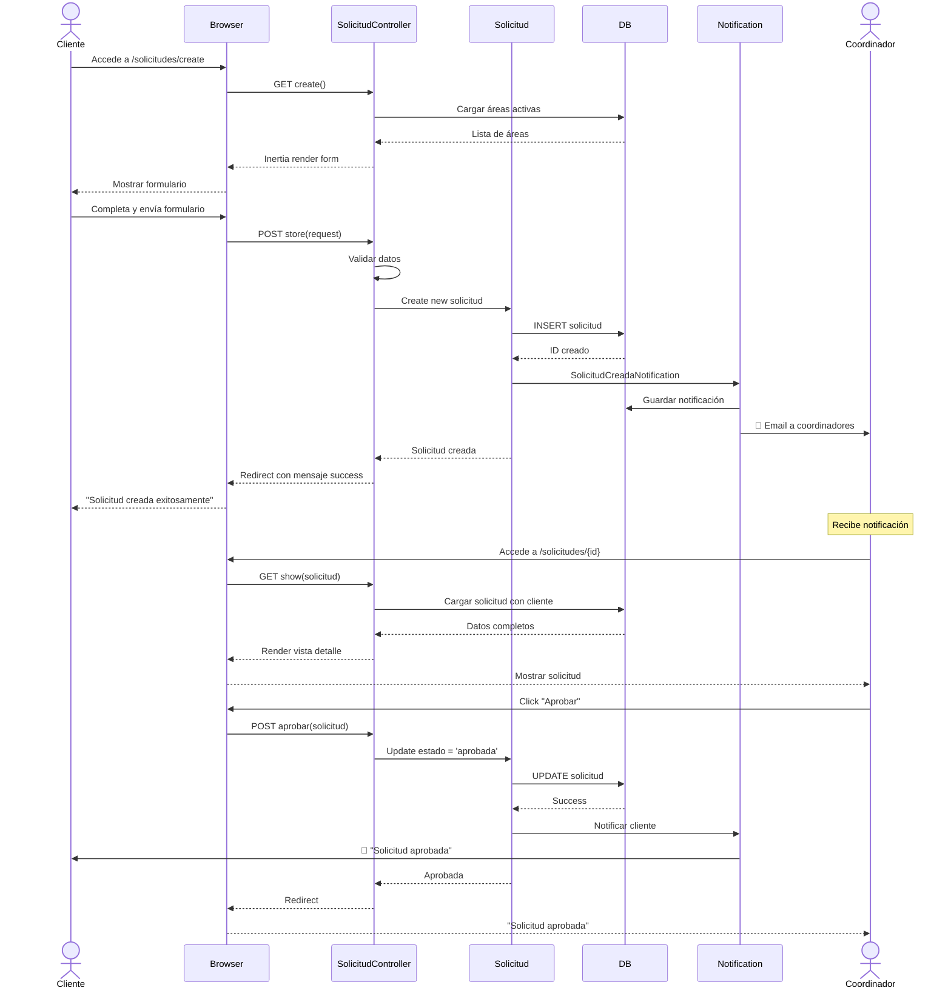

---

## 📋 Caso de Uso 2: Crear OT desde Solicitud

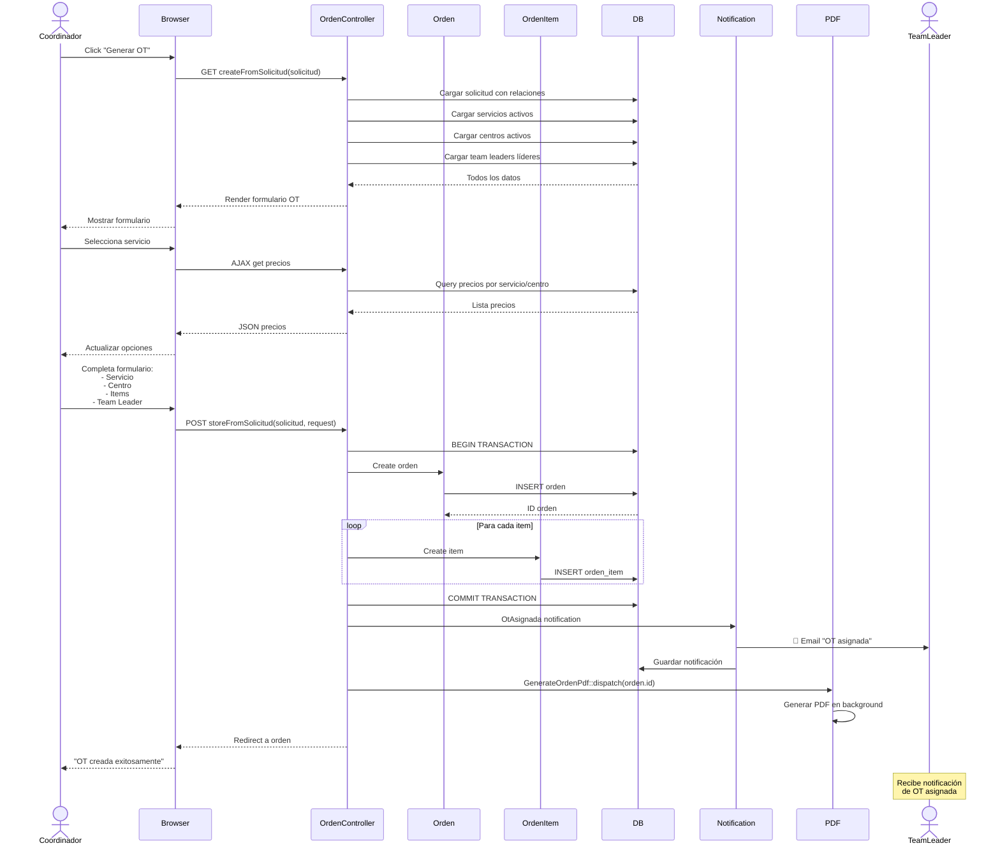

---

## ⚙️ Caso de Uso 3: Registrar Avances y Evidencias

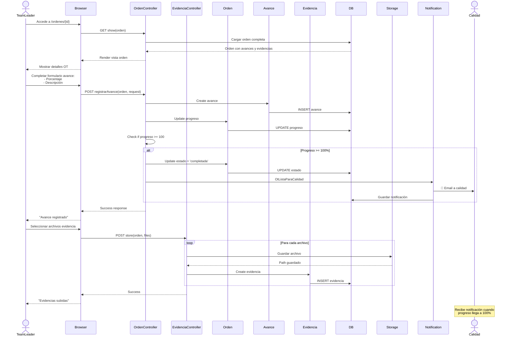

---

## ✅ Caso de Uso 4: Validación de Calidad

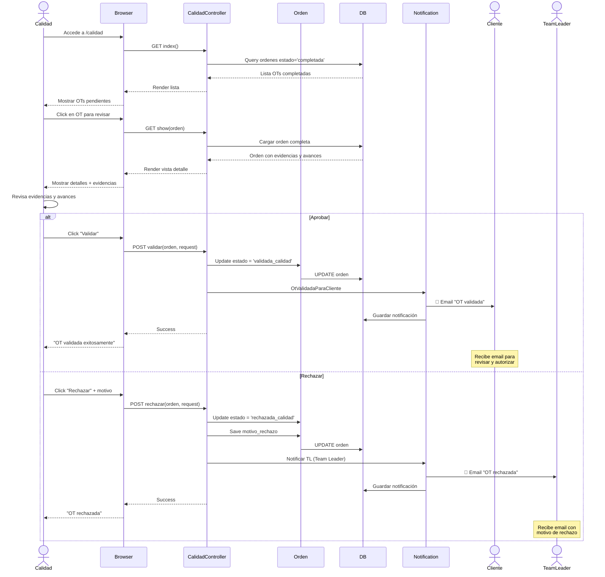

---

## 👥 Caso de Uso 5: Autorización del Cliente

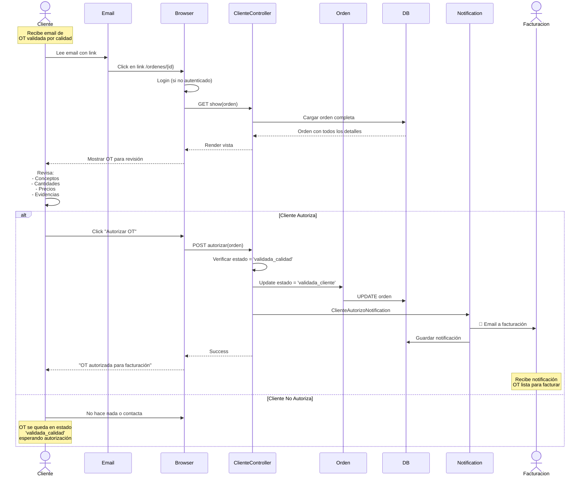

---

## 💰 Caso de Uso 6: Proceso Completo de Facturación (Solo Sistema)

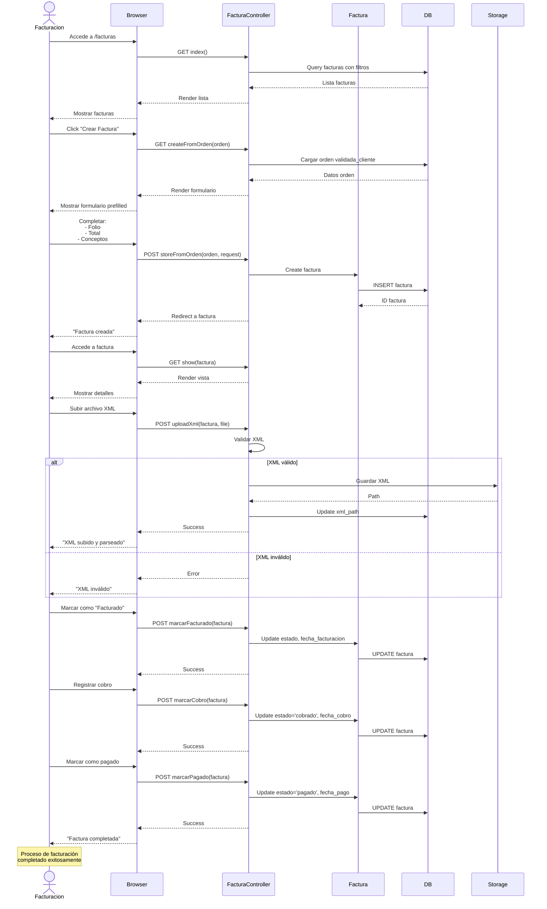

---

## 🔔 Caso de Uso 7: Sistema de Notificaciones

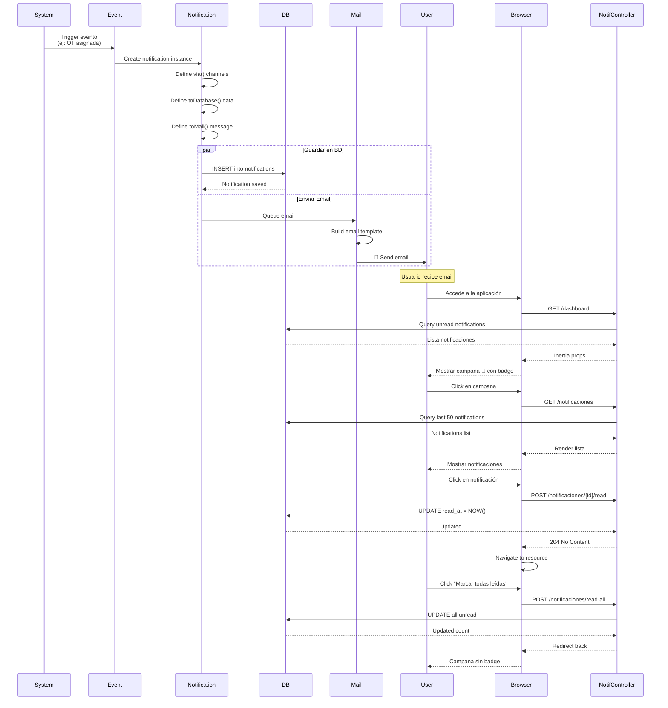

---

## 👤 Caso de Uso 8: Impersonación de Usuarios (Admin)

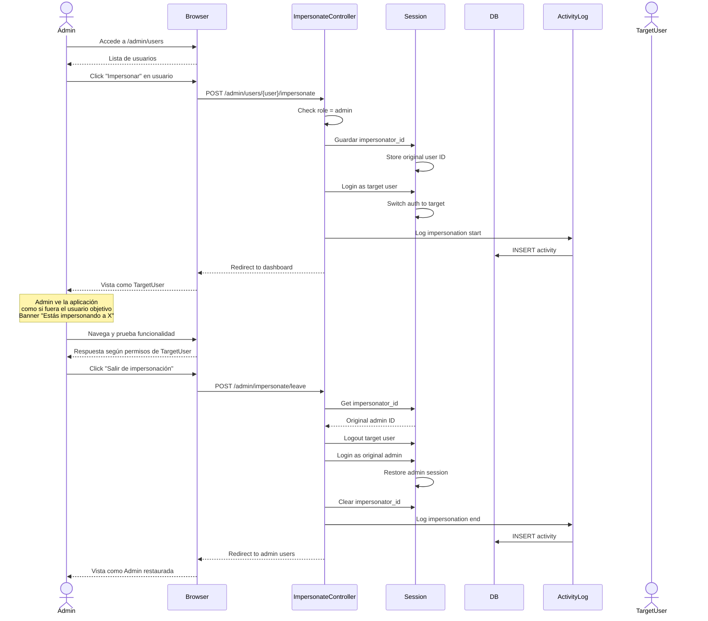

---

## 📊 Caso de Uso 9: Exportar Datos a Excel

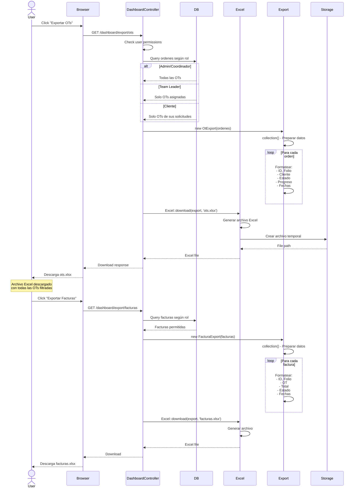

---

## 🔄 Caso de Uso 10: Recordatorios Automáticos

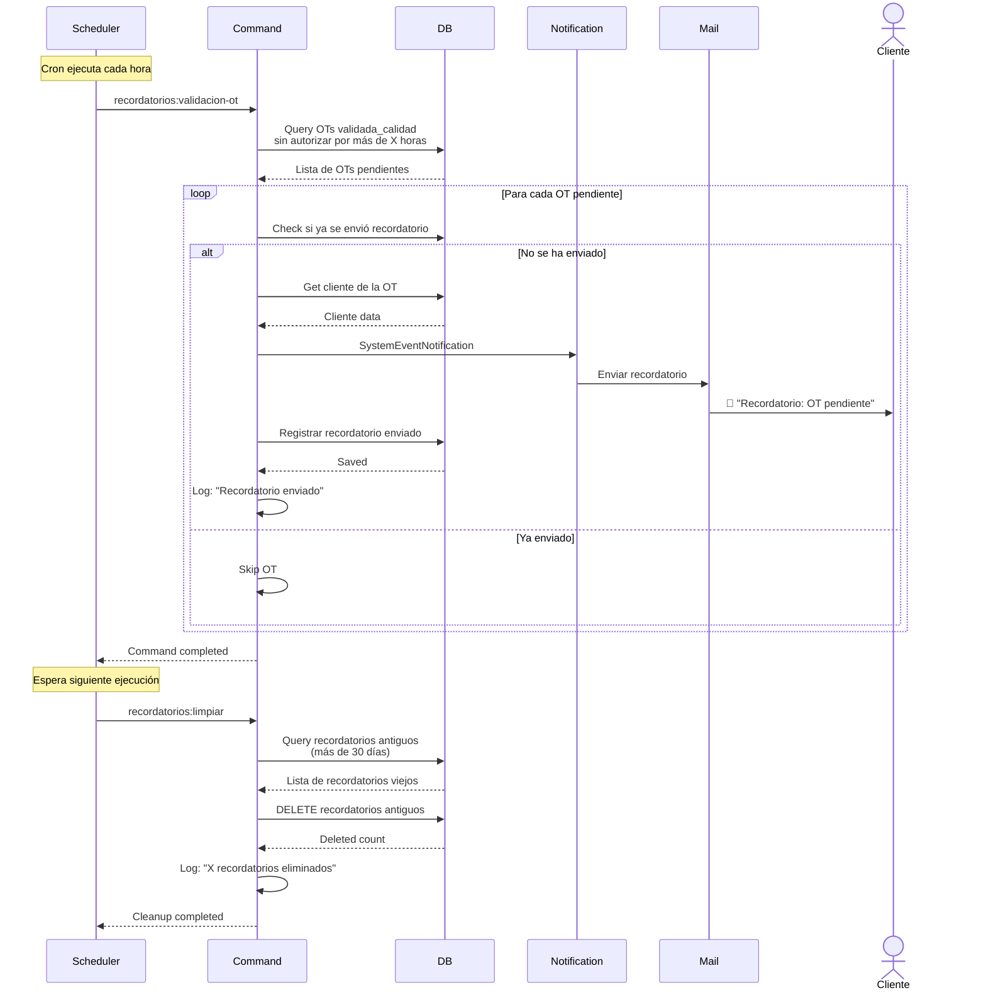

---

## 💾 Caso de Uso 11: Backup Automático

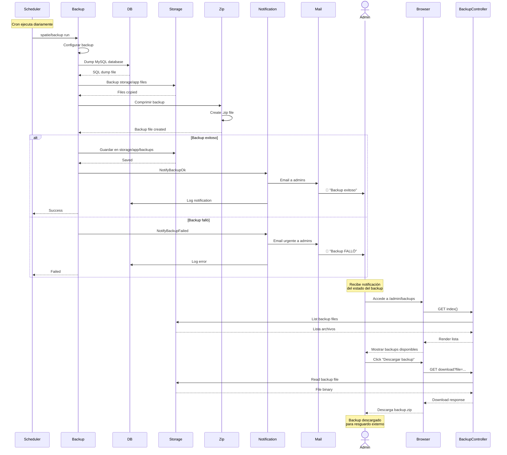

---

## 📱 Caso de Uso 12: Navegación con Inertia.js

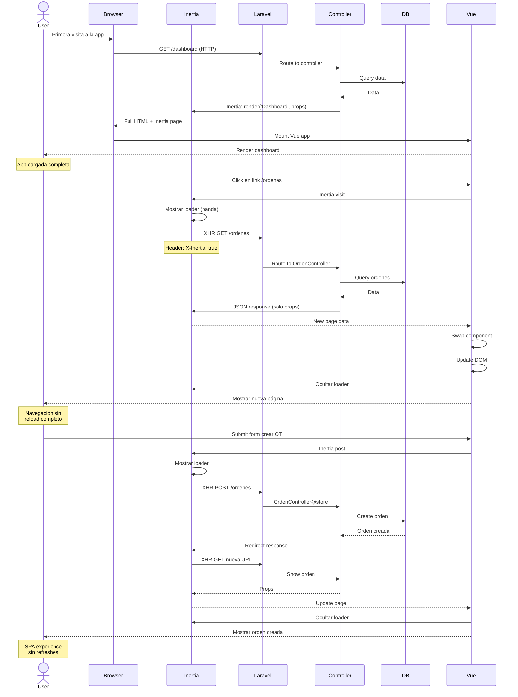

---

**Fecha**: 14 de octubre de 2025  
**Sistema**: UPPER_CONTROL  
**Framework**: Laravel 12 + Vue 3 + Inertia.js
