# Diagramas de Secuencia - UPPER_CONTROL

Diagramas de secuencia detallados de los casos de uso principales del sistema.

---

## 📝 Caso de Uso 1: Crear y Aprobar Solicitud

```mermaid
sequenceDiagram
    actor Cliente
    participant Browser
    participant SolicitudController
    participant Solicitud
    participant DB
    participant Notification
    actor Coordinador

    Cliente->>Browser: Accede a /solicitudes/create
    Browser->>SolicitudController: GET create()
    SolicitudController->>DB: Cargar áreas activas
    DB-->>SolicitudController: Lista de áreas
    SolicitudController-->>Browser: Inertia render form
    Browser-->>Cliente: Mostrar formulario
    
    Cliente->>Browser: Completa y envía formulario
    Browser->>SolicitudController: POST store(request)
    
    SolicitudController->>SolicitudController: Validar datos
    SolicitudController->>Solicitud: Create new solicitud
    Solicitud->>DB: INSERT solicitud
    DB-->>Solicitud: ID creado
    
    Solicitud->>Notification: SolicitudCreadaNotification
    Notification->>DB: Guardar notificación
    Notification->>Coordinador: 📧 Email a coordinadores
    
    Solicitud-->>SolicitudController: Solicitud creada
    SolicitudController-->>Browser: Redirect con mensaje success
    Browser-->>Cliente: "Solicitud creada exitosamente"
    
    Note over Coordinador: Recibe notificación
    
    Coordinador->>Browser: Accede a /solicitudes/{id}
    Browser->>SolicitudController: GET show(solicitud)
    SolicitudController->>DB: Cargar solicitud con cliente
    DB-->>SolicitudController: Datos completos
    SolicitudController-->>Browser: Render vista detalle
    Browser-->>Coordinador: Mostrar solicitud
    
    Coordinador->>Browser: Click "Aprobar"
    Browser->>SolicitudController: POST aprobar(solicitud)
    
    SolicitudController->>Solicitud: Update estado = 'aprobada'
    Solicitud->>DB: UPDATE solicitud
    DB-->>Solicitud: Success
    
    Solicitud->>Notification: Notificar cliente
    Notification->>Cliente: 📧 "Solicitud aprobada"
    
    Solicitud-->>SolicitudController: Aprobada
    SolicitudController-->>Browser: Redirect
    Browser-->>Coordinador: "Solicitud aprobada"
```

---

## 📋 Caso de Uso 2: Crear OT desde Solicitud

```mermaid
sequenceDiagram
    actor Coordinador
    participant Browser
    participant OrdenController
    participant Orden
    participant OrdenItem
    participant DB
    participant Notification
    participant PDF
    actor TecnicoLider

    Coordinador->>Browser: Click "Generar OT"
    Browser->>OrdenController: GET createFromSolicitud(solicitud)
    
    OrdenController->>DB: Cargar solicitud con relaciones
    OrdenController->>DB: Cargar servicios activos
    OrdenController->>DB: Cargar centros activos
    OrdenController->>DB: Cargar técnicos líderes
    DB-->>OrdenController: Todos los datos
    
    OrdenController-->>Browser: Render formulario OT
    Browser-->>Coordinador: Mostrar formulario
    
    Coordinador->>Browser: Selecciona servicio
    Browser->>OrdenController: AJAX get precios
    OrdenController->>DB: Query precios por servicio/centro
    DB-->>OrdenController: Lista precios
    OrdenController-->>Browser: JSON precios
    Browser-->>Coordinador: Actualizar opciones
    
    Coordinador->>Browser: Completa formulario:<br/>- Servicio<br/>- Centro<br/>- Items<br/>- Técnico Líder
    Browser->>OrdenController: POST storeFromSolicitud(solicitud, request)
    
    OrdenController->>DB: BEGIN TRANSACTION
    
    OrdenController->>Orden: Create orden
    Orden->>DB: INSERT orden
    DB-->>Orden: ID orden
    
    loop Para cada item
        OrdenController->>OrdenItem: Create item
        OrdenItem->>DB: INSERT orden_item
    end
    
    OrdenController->>DB: COMMIT TRANSACTION
    
    OrdenController->>Notification: OtAsignada notification
    Notification->>TecnicoLider: 📧 Email "OT asignada"
    Notification->>DB: Guardar notificación
    
    OrdenController->>PDF: GenerateOrdenPdf::dispatch(orden.id)
    PDF->>PDF: Generar PDF en background
    
    OrdenController-->>Browser: Redirect a orden
    Browser-->>Coordinador: "OT creada exitosamente"
    
    Note over TecnicoLider: Recibe notificación<br/>de OT asignada
```

---

## ⚙️ Caso de Uso 3: Registrar Avances y Evidencias

---

## ✅ Caso de Uso 4: Validación de Calidad

```mermaid
sequenceDiagram
    actor Calidad
    participant Browser
    participant CalidadController
    participant Orden
    participant DB
    participant Notification
    actor Cliente
    actor TecnicoLider

    Calidad->>Browser: Accede a /calidad
    Browser->>CalidadController: GET index()
    CalidadController->>DB: Query ordenes estado='completada'
    DB-->>CalidadController: Lista OTs completadas
    CalidadController-->>Browser: Render lista
    Browser-->>Calidad: Mostrar OTs pendientes
    
    Calidad->>Browser: Click en OT para revisar
    Browser->>CalidadController: GET show(orden)
    CalidadController->>DB: Cargar orden completa
    DB-->>CalidadController: Orden con evidencias y avances
    CalidadController-->>Browser: Render vista detalle
    Browser-->>Calidad: Mostrar detalles + evidencias
    
    Calidad->>Calidad: Revisa evidencias y avances
    
    alt Aprobar
        Calidad->>Browser: Click "Validar"
        Browser->>CalidadController: POST validar(orden, request)
        
        CalidadController->>Orden: Update estado = 'validada_calidad'
        Orden->>DB: UPDATE orden
        
        CalidadController->>Notification: OtValidadaParaCliente
        Notification->>Cliente: 📧 Email "OT validada"
        Notification->>DB: Guardar notificación
        
        CalidadController-->>Browser: Success
        Browser-->>Calidad: "OT validada exitosamente"
        
        Note over Cliente: Recibe email para<br/>revisar y autorizar
    else Rechazar
        Calidad->>Browser: Click "Rechazar" + motivo
        Browser->>CalidadController: POST rechazar(orden, request)
        
        CalidadController->>Orden: Update estado = 'rechazada_calidad'
        CalidadController->>Orden: Save motivo_rechazo
        Orden->>DB: UPDATE orden
        
        CalidadController->>Notification: Notificar TL
        Notification->>TecnicoLider: 📧 Email "OT rechazada"
        Notification->>DB: Guardar notificación
        
        CalidadController-->>Browser: Success
        Browser-->>Calidad: "OT rechazada"
        
        Note over TecnicoLider: Recibe email con<br/>motivo de rechazo
    end
```

---

## 👥 Caso de Uso 5: Autorización del Cliente

```mermaid
sequenceDiagram
    actor Cliente
    participant Email
    participant Browser
    participant ClienteController
    participant Orden
    participant DB
    participant Notification
    actor Facturacion

    Note over Cliente: Recibe email de<br/>OT validada por calidad
    
    Cliente->>Email: Lee email con link
    Email->>Browser: Click en link /ordenes/{id}
    Browser->>Browser: Login (si no autenticado)
    
    Browser->>ClienteController: GET show(orden)
    ClienteController->>DB: Cargar orden completa
    DB-->>ClienteController: Orden con todos los detalles
    ClienteController-->>Browser: Render vista
    Browser-->>Cliente: Mostrar OT para revisión
    
    Cliente->>Cliente: Revisa:<br/>- Conceptos<br/>- Cantidades<br/>- Precios<br/>- Evidencias
    
    alt Cliente Autoriza
        Cliente->>Browser: Click "Autorizar OT"
        Browser->>ClienteController: POST autorizar(orden)
        
        ClienteController->>ClienteController: Verificar estado = 'validada_calidad'
        
        ClienteController->>Orden: Update estado = 'validada_cliente'
        Orden->>DB: UPDATE orden
        
        ClienteController->>Notification: ClienteAutorizoNotification
        Notification->>Facturacion: 📧 Email a facturación
        Notification->>DB: Guardar notificación
        
        ClienteController-->>Browser: Success
        Browser-->>Cliente: "OT autorizada para facturación"
        
        Note over Facturacion: Recibe notificación<br/>OT lista para facturar
    else Cliente No Autoriza
        Cliente->>Browser: No hace nada o contacta
        
        Note over Cliente: OT se queda en estado<br/>'validada_calidad'<br/>esperando autorización
    end
```

---

## 💰 Caso de Uso 6: Proceso Completo de Facturación

```mermaid
sequenceDiagram
    actor Facturacion
    participant Browser
    participant FacturaController
    participant Factura
    participant DB
    participant Queue
    participant Job
    participant PDF
    participant QR
    participant Storage
    participant Mail
    actor Cliente

    Facturacion->>Browser: Accede a /facturas
    Browser->>FacturaController: GET index()
    FacturaController->>DB: Query facturas con filtros
    DB-->>FacturaController: Lista facturas
    FacturaController-->>Browser: Render lista
    Browser-->>Facturacion: Mostrar facturas
    
    Facturacion->>Browser: Click "Crear Factura"
    Browser->>FacturaController: GET createFromOrden(orden)
    FacturaController->>DB: Cargar orden validada_cliente
    DB-->>FacturaController: Datos orden
    FacturaController-->>Browser: Render formulario
    Browser-->>Facturacion: Mostrar formulario prefilled
    
    Facturacion->>Browser: Completar:<br/>- Folio<br/>- Total<br/>- Conceptos
    Browser->>FacturaController: POST storeFromOrden(orden, request)
    
    FacturaController->>Factura: Create factura
    Factura->>DB: INSERT factura
    DB-->>Factura: ID factura
    
    FacturaController->>Queue: GenerateFacturaPdf::dispatch(id, true)
    
    par Proceso en Background
        Queue->>Job: Execute job
        Job->>DB: Load factura con relaciones
        DB-->>Job: Factura completa
        
        Job->>Job: parseCfdi() - Parse XML
        
        alt XML existe
            Job->>Job: Extract CFDI data
            Job->>Job: Emisor, Receptor, UUID, etc.
        else No XML
            Job->>Job: Usar datos de BD
        end
        
        Job->>QR: generateQrCode()
        QR->>QR: Construir URL SAT
        
        alt Imagick disponible
            QR->>QR: Generate PNG
        else Fallback
            QR->>QR: Generate SVG
        end
        
        QR-->>Job: QR code data
        
        Job->>PDF: loadView('pdf.factura', data)
        PDF->>PDF: Render HTML con:<br/>- Datos XML<br/>- QR code<br/>- Conceptos<br/>- Totales
        PDF-->>Job: PDF binary
        
        Job->>Storage: Guardar PDF
        Storage-->>Job: Path guardado
        
        Job->>DB: Update pdf_path
        
        Job->>Mail: FacturaGeneradaNotification
        Mail->>Storage: Read PDF file
        Storage-->>Mail: PDF binary
        Mail->>Cliente: 📧 Email con PDF adjunto
        Mail->>DB: Save notification
        
        Job-->>Queue: Job completed
    end
    
    FacturaController-->>Browser: Redirect a factura
    Browser-->>Facturacion: "Factura creada"
    
    Note over Cliente: Recibe email con<br/>PDF de factura adjunto
    
    Facturacion->>Browser: Accede a factura
    Browser->>FacturaController: GET show(factura)
    FacturaController-->>Browser: Render vista
    Browser-->>Facturacion: Mostrar detalles
    
    Facturacion->>Browser: Subir archivo XML
    Browser->>FacturaController: POST uploadXml(factura, file)
    
    FacturaController->>FacturaController: Validar XML
    
    alt XML válido
        FacturaController->>Storage: Guardar XML
        Storage-->>FacturaController: Path
        FacturaController->>DB: Update xml_path
        FacturaController-->>Browser: Success
        Browser-->>Facturacion: "XML subido"
    else XML inválido
        FacturaController-->>Browser: Error
        Browser-->>Facturacion: "XML inválido"
    end
    
    Facturacion->>Browser: Marcar como "Facturado"
    Browser->>FacturaController: POST marcarFacturado(factura)
    FacturaController->>Factura: Update estado, fecha_facturacion
    Factura->>DB: UPDATE factura
    FacturaController-->>Browser: Success
    
    Facturacion->>Browser: Registrar cobro
    Browser->>FacturaController: POST marcarCobro(factura)
    FacturaController->>Factura: Update estado='cobrado', fecha_cobro
    Factura->>DB: UPDATE factura
    FacturaController-->>Browser: Success
    
    Facturacion->>Browser: Marcar como pagado
    Browser->>FacturaController: POST marcarPagado(factura)
    FacturaController->>Factura: Update estado='pagado', fecha_pago
    Factura->>DB: UPDATE factura
    FacturaController-->>Browser: Success
    Browser-->>Facturacion: "Factura completada"
    
    Note over Facturacion,Cliente: Proceso de facturación<br/>completado exitosamente
```

---

## 🔔 Caso de Uso 7: Sistema de Notificaciones

```mermaid
sequenceDiagram
    participant System
    participant Event
    participant Notification
    participant DB
    participant Mail
    participant User
    participant Browser
    participant NotifController

    System->>Event: Trigger evento<br/>(ej: OT asignada)
    Event->>Notification: Create notification instance
    
    Notification->>Notification: Define via() channels
    Notification->>Notification: Define toDatabase() data
    Notification->>Notification: Define toMail() message
    
    par Guardar en BD
        Notification->>DB: INSERT into notifications
        DB-->>Notification: Notification saved
    and Enviar Email
        Notification->>Mail: Queue email
        Mail->>Mail: Build email template
        Mail->>User: 📧 Send email
    end
    
    Note over User: Usuario recibe email
    
    User->>Browser: Accede a la aplicación
    Browser->>NotifController: GET /dashboard
    NotifController->>DB: Query unread notifications
    DB-->>NotifController: Lista notificaciones
    NotifController-->>Browser: Inertia props
    Browser-->>User: Mostrar campana 🔔 con badge
    
    User->>Browser: Click en campana
    Browser->>NotifController: GET /notificaciones
    NotifController->>DB: Query last 50 notifications
    DB-->>NotifController: Notifications list
    NotifController-->>Browser: Render lista
    Browser-->>User: Mostrar notificaciones
    
    User->>Browser: Click en notificación
    Browser->>NotifController: POST /notificaciones/{id}/read
    NotifController->>DB: UPDATE read_at = NOW()
    DB-->>NotifController: Updated
    NotifController-->>Browser: 204 No Content
    Browser->>Browser: Navigate to resource
    
    User->>Browser: Click "Marcar todas leídas"
    Browser->>NotifController: POST /notificaciones/read-all
    NotifController->>DB: UPDATE all unread
    DB-->>NotifController: Updated count
    NotifController-->>Browser: Redirect back
    Browser-->>User: Campana sin badge
```

---

## 👤 Caso de Uso 8: Impersonación de Usuarios (Admin)

```mermaid
sequenceDiagram
    actor Admin
    participant Browser
    participant ImpersonateController
    participant Session
    participant DB
    participant ActivityLog
    actor TargetUser

    Admin->>Browser: Accede a /admin/users
    Browser-->>Admin: Lista de usuarios
    
    Admin->>Browser: Click "Impersonar" en usuario
    Browser->>ImpersonateController: POST /admin/users/{user}/impersonate
    
    ImpersonateController->>ImpersonateController: Check role = admin
    
    ImpersonateController->>Session: Guardar impersonator_id
    Session->>Session: Store original user ID
    
    ImpersonateController->>Session: Login as target user
    Session->>Session: Switch auth to target
    
    ImpersonateController->>ActivityLog: Log impersonation start
    ActivityLog->>DB: INSERT activity
    
    ImpersonateController-->>Browser: Redirect to dashboard
    Browser-->>Admin: Vista como TargetUser
    
    Note over Admin: Admin ve la aplicación<br/>como si fuera el usuario objetivo<br/>Banner "Estás impersonando a X"
    
    Admin->>Browser: Navega y prueba funcionalidad
    Browser-->>Admin: Respuesta según permisos de TargetUser
    
    Admin->>Browser: Click "Salir de impersonación"
    Browser->>ImpersonateController: POST /admin/impersonate/leave
    
    ImpersonateController->>Session: Get impersonator_id
    Session-->>ImpersonateController: Original admin ID
    
    ImpersonateController->>Session: Logout target user
    ImpersonateController->>Session: Login as original admin
    Session->>Session: Restore admin session
    
    ImpersonateController->>Session: Clear impersonator_id
    
    ImpersonateController->>ActivityLog: Log impersonation end
    ActivityLog->>DB: INSERT activity
    
    ImpersonateController-->>Browser: Redirect to admin users
    Browser-->>Admin: Vista como Admin restaurada
```

---

## 📊 Caso de Uso 9: Exportar Datos a Excel

---

## 🔄 Caso de Uso 10: Recordatorios Automáticos

```mermaid
sequenceDiagram
    participant Scheduler
    participant Command
    participant DB
    participant Notification
    participant Mail
    actor Cliente

    Note over Scheduler: Cron ejecuta cada hora

    Scheduler->>Command: recordatorios:validacion-ot
    Command->>DB: Query OTs validada_calidad<br/>sin autorizar por más de X horas
    DB-->>Command: Lista de OTs pendientes
    
    loop Para cada OT pendiente
        Command->>DB: Check si ya se envió recordatorio
        
        alt No se ha enviado
            Command->>DB: Get cliente de la OT
            DB-->>Command: Cliente data
            
            Command->>Notification: SystemEventNotification
            Notification->>Mail: Enviar recordatorio
            Mail->>Cliente: 📧 "Recordatorio: OT pendiente"
            
            Command->>DB: Registrar recordatorio enviado
            DB-->>Command: Saved
            
            Command->>Command: Log: "Recordatorio enviado"
        else Ya enviado
            Command->>Command: Skip OT
        end
    end
    
    Command-->>Scheduler: Command completed
    
    Note over Scheduler: Espera siguiente ejecución
    
    Scheduler->>Command: recordatorios:limpiar
    Command->>DB: Query recordatorios antiguos<br/>(más de 30 días)
    DB-->>Command: Lista de recordatorios viejos
    
    Command->>DB: DELETE recordatorios antiguos
    DB-->>Command: Deleted count
    
    Command->>Command: Log: "X recordatorios eliminados"
    Command-->>Scheduler: Cleanup completed
```

---

## 💾 Caso de Uso 11: Backup Automático

```mermaid
sequenceDiagram
    participant Scheduler
    participant Backup
    participant DB
    participant Storage
    participant Zip
    participant Notification
    participant Mail
    actor Admin

    Note over Scheduler: Cron ejecuta diariamente

    Scheduler->>Backup: spatie/backup run
    Backup->>Backup: Configurar backup
    
    Backup->>DB: Dump MySQL database
    DB-->>Backup: SQL dump file
    
    Backup->>Storage: Backup storage/app files
    Storage-->>Backup: Files copied
    
    Backup->>Zip: Comprimir backup
    Zip->>Zip: Create .zip file
    Zip-->>Backup: Backup file created
    
    alt Backup exitoso
        Backup->>Storage: Guardar en storage/app/backups
        Storage-->>Backup: Saved
        
        Backup->>Notification: NotifyBackupOk
        Notification->>Mail: Email a admins
        Mail->>Admin: 📧 "Backup exitoso"
        Notification->>DB: Log notification
        
        Backup-->>Scheduler: Success
    else Backup falló
        Backup->>Notification: NotifyBackupFailed
        Notification->>Mail: Email urgente a admins
        Mail->>Admin: 🚨 "Backup FALLÓ"
        Notification->>DB: Log error
        
        Backup-->>Scheduler: Failed
    end
    
    Note over Admin: Recibe notificación<br/>del estado del backup
    
    Admin->>Browser: Accede a /admin/backups
    Browser->>BackupController: GET index()
    BackupController->>Storage: List backup files
    Storage-->>BackupController: Lista archivos
    BackupController-->>Browser: Render lista
    Browser-->>Admin: Mostrar backups disponibles
    
    Admin->>Browser: Click "Descargar backup"
    Browser->>BackupController: GET download?file=...
    BackupController->>Storage: Read backup file
    Storage-->>BackupController: File binary
    BackupController-->>Browser: Download response
    Browser-->>Admin: Descarga backup.zip
    
    Note over Admin: Backup descargado<br/>para resguardo externo
```

---

## 📱 Caso de Uso 12: Navegación con Inertia.js

---

**Fecha**: 14 de octubre de 2025  
**Sistema**: UPPER_CONTROL  
**Framework**: Laravel 12 + Vue 3 + Inertia.js
