# Diagramas Técnicos - UPPER_CONTROL

Diagramas detallados de arquitectura, flujos técnicos y procesos internos.

---

## 🏗️ Arquitectura del Sistema

```mermaid
graph TB
    subgraph Cliente["💻 Cliente (Navegador)"]
        UI[Vue.js 3 + Inertia.js]
        CSS[Tailwind CSS]
    end
    
    subgraph Servidor["🖥️ Servidor XAMPP"]
        subgraph Laravel["Laravel 12"]
            Routes[Routes]
            Controllers[Controllers]
            Models[Eloquent Models]
            Jobs[Jobs/Queue]
            Notifications[Notifications]
            Middleware[Middleware]
            Policies[Policies]
        end
        
        subgraph Servicios["📦 Servicios"]
            PDF[Dompdf]
            QR[Simple QR Code]
            Mail[Laravel Mail]
            Permission[Spatie Permission]
            ActivityLog[Spatie Activity Log]
            Backup[Spatie Backup]
            Excel[Maatwebsite Excel]
        end
        
        subgraph Storage["💾 Almacenamiento"]
            FileSystem[Local Storage]
            PDFs[PDFs]
            XMLs[XMLs]
            Images[Imágenes]
        end
    end
    
    subgraph Database["🗄️ Base de Datos"]
        MySQL[(MySQL)]
        Tables[Tablas]
        Migrations[Migrations]
        Seeders[Seeders]
    end
    
    UI <-->|HTTP/AJAX| Routes
    Routes --> Middleware
    Middleware --> Controllers
    Controllers --> Models
    Controllers --> Jobs
    Controllers --> Notifications
    Models <--> MySQL
    Jobs --> PDF
    Jobs --> QR
    Jobs --> Mail
    Notifications --> Mail
    Jobs --> FileSystem
    Models --> Tables
    
    style Cliente fill:#42b883,stroke:#35495e,color:#fff
    style Servidor fill:#ff2d20,stroke:#c62828,color:#fff
    style Database fill:#00758f,stroke:#004d61,color:#fff
    style Laravel fill:#fff3e0,stroke:#ff6f00
    style Servicios fill:#e8eaf6,stroke:#3f51b5
    style Storage fill:#e0f2f1,stroke:#00796b
```



---

## 🔄 Flujo de Procesamiento de Factura (Job)


---

## 📊 Flujo de Datos - Solicitud a Factura


---

## 🔐 Sistema de Autenticación y Autorización

```mermaid
flowchart TD
    Start([Usuario accede]) --> Login[Login Form]
    Login --> Auth{Autenticación<br/>Laravel Breeze}
    
    Auth -->|Falla| LoginError[Error: Credenciales inválidas]
    LoginError --> Login
    
    Auth -->|Éxito| CheckActive{¿Usuario activo?}
    CheckActive -->|No| Inactive[Usuario desactivado]
    Inactive --> Logout([Logout])
    
    CheckActive -->|Sí| Session[Crear sesión]
    Session --> LoadRole[Cargar rol y permisos]
    
    LoadRole --> RoleCheck{Tipo de usuario}
    
    RoleCheck -->|admin| AdminAccess[✅ Acceso total<br/>+ Impersonación]
    RoleCheck -->|coordinador| CoordAccess[✅ Gestión de<br/>Solicitudes y OTs]
    RoleCheck -->|tecnico_lider| TLAccess[✅ OTs asignadas<br/>Avances y evidencias]
    RoleCheck -->|calidad| CalAccess[✅ Validación<br/>de calidad]
    RoleCheck -->|facturacion| FactAccess[✅ Gestión de<br/>facturas]
    RoleCheck -->|cliente| ClienteAccess[✅ Solicitudes<br/>Autorización OTs]
    
    AdminAccess --> Dashboard[Dashboard]
    CoordAccess --> Dashboard
    TLAccess --> Dashboard
    CalAccess --> Dashboard
    FactAccess --> Dashboard
    ClienteAccess --> Dashboard
    
    Dashboard --> Route[Usuario accede a ruta]
    Route --> Middleware{Middleware<br/>role:xxx}
    
    Middleware -->|Autorizado| Policy{Policy check}
    Middleware -->|No autorizado| Error403[403 Forbidden]
    
    Policy -->|Permitido| Controller[Controller action]
    Policy -->|Denegado| Error403
    
    Controller --> Response[Respuesta Inertia]
    Response --> UI[Render Vue.js]
    
    Error403 --> ErrorPage[Página de error]
    
    style Start fill:#4caf50,stroke:#2e7d32,color:#fff
    style Dashboard fill:#2196f3,stroke:#1565c0,color:#fff
    style Error403 fill:#f44336,stroke:#c62828,color:#fff
    style AdminAccess fill:#ff9800,stroke:#e65100,color:#fff
```



---

## 📧 Sistema de Notificaciones


---

## 🗄️ Modelo de Base de Datos Detallado

```mermaid
erDiagram
    USERS {
        bigint id PK
        string name
        string email UK
        timestamp email_verified_at
        string password
        string role
        boolean activo
        string remember_token
        timestamps
    }
    
    SOLICITUDES {
        bigint id PK
        bigint id_cliente FK
        bigint id_area FK
        text descripcion
        string prioridad
        enum estado
        text motivo_rechazo
        bigint aprobado_por FK
        timestamp aprobado_at
        timestamps
    }
    
    ORDENES {
        bigint id PK
        bigint id_solicitud FK
        bigint id_tl FK
        bigint id_servicio FK
        bigint id_centro FK
        string numero_ot
        enum estado
        decimal progreso
        text observaciones
        timestamp fecha_inicio
        timestamp fecha_fin
        timestamps
    }
    
    ORDEN_ITEMS {
        bigint id PK
        bigint id_orden FK
        string concepto
        integer cantidad
        decimal precio_unitario
        decimal subtotal
        timestamps
    }
    
    AVANCES {
        bigint id PK
        bigint id_orden FK
        bigint id_usuario FK
        decimal porcentaje
        text descripcion
        timestamp fecha
        timestamps
    }
    
    EVIDENCIAS {
        bigint id PK
        bigint id_orden FK
        bigint id_usuario FK
        string tipo
        string ruta
        text descripcion
        timestamps
    }
    
    FACTURAS {
        bigint id PK
        bigint id_orden FK
        string folio
        decimal subtotal
        decimal iva
        decimal total
        enum estado
        string pdf_path
        string xml_path
        timestamp fecha_facturacion
        timestamp fecha_cobro
        timestamp fecha_pago
        timestamps
    }
    
    ARCHIVOS {
        bigint id PK
        string nombre_original
        string nombre_guardado
        string ruta
        string mime_type
        bigint tamanio
        morphs archivable
        timestamps
    }
    
    AREAS {
        bigint id PK
        string nombre
        text descripcion
        boolean activa
        timestamps
    }
    
    CENTRO_TRABAJO {
        bigint id PK
        string nombre
        string codigo
        string direccion
        boolean activo
        timestamps
    }
    
    SERVICIO_EMPRESA {
        bigint id PK
        string nombre
        text descripcion
        boolean activo
        timestamps
    }
    
    SERVICIO_CENTRO {
        bigint id PK
        bigint id_servicio FK
        bigint id_centro FK
        timestamps
    }
    
    SERVICIO_TAMANO {
        bigint id PK
        bigint id_servicio_centro FK
        string tamano
        decimal precio
        timestamps
    }
    
    NOTIFICATIONS {
        uuid id PK
        string type
        morphs notifiable
        text data
        timestamp read_at
        timestamps
    }
    
    ACTIVITY_LOG {
        bigint id PK
        string log_name
        text description
        morphs subject
        morphs causer
        text properties
        timestamps
    }
    
    USERS ||--o{ SOLICITUDES : "crea (cliente)"
    USERS ||--o{ SOLICITUDES : "aprueba (coordinador)"
    USERS ||--o{ ORDENES : "asignado (TL)"
    USERS ||--o{ AVANCES : "registra"
    USERS ||--o{ EVIDENCIAS : "sube"
    USERS ||--o{ NOTIFICATIONS : "recibe"
    USERS ||--o{ ACTIVITY_LOG : "causa"
    
    AREAS ||--o{ SOLICITUDES : "pertenece"
    
    SOLICITUDES ||--o| ORDENES : "genera"
    
    ORDENES ||--o{ ORDEN_ITEMS : "contiene"
    ORDENES ||--o{ AVANCES : "tiene"
    ORDENES ||--o{ EVIDENCIAS : "tiene"
    ORDENES ||--o| FACTURAS : "genera"
    ORDENES }o--|| CENTRO_TRABAJO : "ubicacion"
    ORDENES }o--|| SERVICIO_EMPRESA : "tipo_servicio"
    
    FACTURAS ||--o{ ARCHIVOS : "xml (polymorphic)"
    
    SERVICIO_EMPRESA ||--o{ SERVICIO_CENTRO : "disponible_en"
    CENTRO_TRABAJO ||--o{ SERVICIO_CENTRO : "ofrece"
    SERVICIO_CENTRO ||--o{ SERVICIO_TAMANO : "precios"
```

---

## 🔄 Job Queue System


---

## 📄 Proceso de Generación de PDF

```mermaid
flowchart TD
    Start([Inicio Generación PDF]) --> Type{Tipo de PDF}
    
    Type -->|Factura| LoadFactura[Cargar Factura<br/>con relaciones]
    Type -->|Orden| LoadOrden[Cargar Orden<br/>con relaciones]
    
    LoadFactura --> ParseXML{¿Existe XML?}
    ParseXML -->|Sí| ExtractCFDI[Extraer datos CFDI<br/>parseCfdi method]
    ParseXML -->|No| DefaultData[Usar datos de BD]
    
    ExtractCFDI --> ProcessData[Procesar datos:<br/>- Emisor<br/>- Receptor<br/>- Conceptos<br/>- Impuestos<br/>- Timbre<br/>- UUID]
    DefaultData --> PrepareView
    ProcessData --> GenQR[Generar QR SAT]
    
    GenQR --> TryPNG{¿Imagick<br/>disponible?}
    TryPNG -->|Sí| QRPng[QR formato PNG]
    TryPNG -->|No| QRSvg[QR formato SVG]
    
    QRPng --> PrepareView[Preparar datos para vista]
    QRSvg --> PrepareView
    
    LoadOrden --> PrepareView
    
    PrepareView --> SelectView{Seleccionar vista}
    SelectView -->|Factura| ViewFactura[pdf.factura]
    SelectView -->|Orden| ViewOrden[pdf.orden]
    
    ViewFactura --> LoadView[Dompdf::loadView]
    ViewOrden --> LoadView
    
    LoadView --> SetPaper[setPaper('letter')]
    SetPaper --> RenderPDF[Renderizar PDF]
    
    RenderPDF --> SaveStorage[Guardar en Storage]
    SaveStorage --> UpdateDB[Actualizar path en BD]
    
    UpdateDB --> CheckNotify{¿Enviar<br/>notificación?}
    CheckNotify -->|Sí| SendMail[Enviar Email<br/>con PDF adjunto]
    CheckNotify -->|No| End
    
    SendMail --> End([PDF Generado])
    
    style Start fill:#4caf50,stroke:#2e7d32,color:#fff
    style End fill:#4caf50,stroke:#2e7d32,color:#fff
    style GenQR fill:#ff9800,stroke:#e65100,color:#fff
    style RenderPDF fill:#2196f3,stroke:#1565c0,color:#fff
    style SendMail fill:#9c27b0,stroke:#6a1b9a,color:#fff
```

---

## 🔍 Parser CFDI (XML Factura)


---

## 🔐 Middleware Stack

```mermaid
graph LR
    Request[HTTP Request] --> M1[StartSession]
    M1 --> M2[ShareErrorsFromSession]
    M2 --> M3[VerifyCsrfToken]
    M3 --> M4[SubstituteBindings]
    M4 --> M5[HandleInertiaRequests]
    
    M5 --> Auth{Ruta protegida?}
    Auth -->|No| Controller
    Auth -->|Sí| M6[Authenticate]
    
    M6 --> Role{Requiere rol?}
    Role -->|No| Controller
    Role -->|Sí| M7[EnsureUserHasRole]
    
    M7 --> Permission{Requiere permiso?}
    Permission -->|No| Controller
    Permission -->|Sí| M8[Permission Middleware]
    
    M8 --> Controller[Controller]
    Controller --> Policy[Policy Check]
    Policy --> Action[Controller Action]
    Action --> Response[Response]
    
    Response --> M9[HandleInertiaRequests]
    M9 --> M10[AddQueuedCookiesToResponse]
    M10 --> M11[EncryptCookies]
    M11 --> Output[HTTP Response]
    
    style Request fill:#4caf50,stroke:#2e7d32,color:#fff
    style Output fill:#4caf50,stroke:#2e7d32,color:#fff
    style M6 fill:#ff9800,stroke:#e65100,color:#fff
    style M7 fill:#f44336,stroke:#c62828,color:#fff
    style M8 fill:#f44336,stroke:#c62828,color:#fff
```



---

## 📊 Dashboard Data Flow


---

## 🎨 Frontend Component Architecture


---

## 📱 Loading System (Banda Transportadora)

```mermaid
flowchart TD
    Start([Navegación/Acción]) --> Trigger[Evento Inertia]
    Trigger --> Check{Tipo de acción}
    
    Check -->|Primera carga| AppSplash[App Splash Screen<br/>Logo + Barra progreso]
    Check -->|Navegación| ProcessLoader[Process Loader<br/>Banda transportadora]
    
    ProcessLoader --> Show[Mostrar loader]
    Show --> UpdateText[Actualizar texto según ruta:<br/>- factura: "Procesando factura..."<br/>- orden: "Procesando orden..."<br/>- etc.]
    
    UpdateText --> Animate[Animación CSS:<br/>- Cajas moviéndose<br/>- Banda girando<br/>- Delay entre cajas]
    
    Animate --> Wait[Esperar respuesta]
    Wait --> Response{Respuesta recibida}
    
    Response -->|Success| Hide[Ocultar loader]
    Response -->|Error| ShowError[Mostrar error]
    ShowError --> Hide
    
    AppSplash --> ProgressBar[Barra de progreso<br/>animada 14% → 100%]
    ProgressBar --> AppLoaded[App cargada]
    AppLoaded --> HideApp[Ocultar splash]
    
    Hide --> Complete([Completado])
    HideApp --> Complete
    
    style Start fill:#4caf50,stroke:#2e7d32,color:#fff
    style Complete fill:#4caf50,stroke:#2e7d32,color:#fff
    style Animate fill:#ff9800,stroke:#e65100,color:#fff
    style ShowError fill:#f44336,stroke:#c62828,color:#fff
```

---

## 🔧 Configuración del Entorno


---

## 📝 Resumen de Patrones de Diseño Utilizados

### 🏗️ Arquitecturales
- **MVC**: Model-View-Controller (Laravel)
- **Repository Pattern**: Eloquent ORM
- **Service Container**: Laravel IoC Container
- **Facade Pattern**: Laravel Facades

### 🔄 De Comportamiento
- **Observer Pattern**: Laravel Events & Listeners
- **Strategy Pattern**: Queue Drivers, Mail Drivers
- **Command Pattern**: Artisan Commands
- **Chain of Responsibility**: Middleware Stack

### 🏭 Creacionales
- **Factory Pattern**: Model Factories
- **Builder Pattern**: Query Builder, PDF Builder
- **Singleton Pattern**: Config, Cache

### 📊 De Datos
- **Active Record**: Eloquent Models
- **Data Mapper**: Database Migrations
- **Unit of Work**: Database Transactions

---

**Generado**: 14 de octubre de 2025  
**Framework**: Laravel 12.26.4  
**Vue**: 3.x + Inertia.js 2.x
