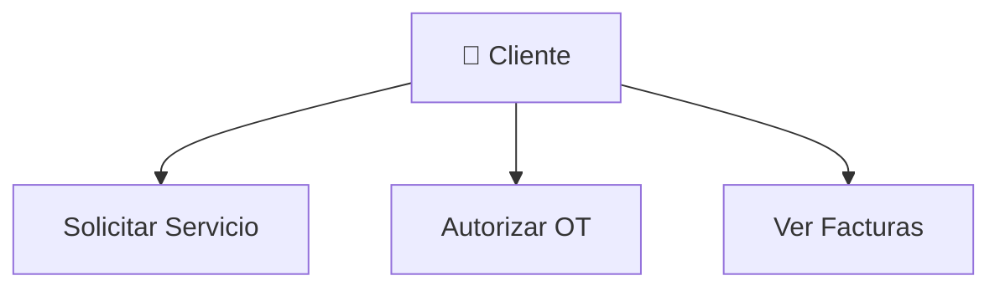

# 📤 Guía de Exportación de Diagramas

## 🎯 Cómo Exportar los Diagramas para tu Documentación

---

## 🚀 MÉTODO 1: Mermaid Live Editor (RECOMENDADO - MÁS FÁCIL)

### ✅ Paso a Paso

1. **Abre Mermaid Live Editor**
   - URL: https://mermaid.live/

2. **Copia el código del diagrama**
   - Abre cualquier archivo `.md` (ej: `DIAGRAMAS.md`)
   - Copia todo el código entre los bloques ` ```mermaid ` y ` ``` `

3. **Pega en Mermaid Live**
   - Pega el código en el panel izquierdo
   - El diagrama se renderiza automáticamente a la derecha

4. **Exporta en el formato deseado**
   - Click en **"Actions"** (parte superior derecha)
   - Selecciona formato:
     - **PNG** - Para documentos Word, PowerPoint, PDFs
     - **SVG** - Para web, escalable sin perder calidad
     - **Markdown** - Para otros archivos Markdown

5. **Descarga**
   - El archivo se descarga automáticamente
   - Úsalo en tu documentación

### 📊 Ejemplo Práctico

**Código del diagrama de casos de uso:**


**Pasos:**
1. Copia ese código completo
2. Pega en https://mermaid.live/
3. Click en "Actions" → "PNG image"
4. Guarda como `casos-uso.png`

### 🎨 Configuración de Calidad

En Mermaid Live puedes ajustar:
- **Tema**: Light, Dark, Forest, Default
- **Escala**: 1x, 2x, 3x (mayor = mejor calidad)
- **Fondo**: Transparente o blanco

---

## 🖥️ MÉTODO 2: VS Code con Extensión (Para Desarrolladores)

### 📦 Instalación

1. **Instala la extensión**
   - Abre VS Code
   - Ve a Extensions (Ctrl+Shift+X)
   - Busca: **"Markdown Preview Mermaid Support"**
   - Click en "Install"

2. **Instala extensión de exportación**
   - Busca: **"Mermaid Export"** o **"Markdown PDF"**
   - Click en "Install"

### ✅ Exportar desde VS Code

#### Opción A: Captura de Pantalla (Rápido)
1. Abre el archivo `.md` (ej: `DIAGRAMAS.md`)
2. Presiona `Ctrl+Shift+V` (Vista previa)
3. Haz zoom al diagrama que quieres
4. Toma captura con Windows Snipping Tool (Win+Shift+S)
5. Guarda la imagen

#### Opción B: Markdown PDF Extension
1. Abre el archivo `.md`
2. Presiona `Ctrl+Shift+P`
3. Escribe: "Markdown PDF: Export (pdf)"
4. Selecciona formato: PDF, PNG, o JPEG
5. El archivo se guarda automáticamente

---

## 🌐 MÉTODO 3: GitHub Directo (Sin Herramientas)

### ✅ Paso a Paso

1. **Abre el diagrama en GitHub**
   - Visita: https://github.com/ABFORTI/UPPER_CONTROL/blob/Diseno/DIAGRAMAS.md
   - GitHub renderiza automáticamente los diagramas

2. **Toma captura de pantalla**
   - **Windows**: Win+Shift+S
   - **Mac**: Cmd+Shift+4
   - Selecciona el área del diagrama

3. **Guarda la imagen**
   - Pega en Paint/Photoshop
   - Guarda como PNG o JPG

4. **Usa en tu documentación**

### 💡 Tips para Mejor Calidad
- Haz zoom en el navegador (Ctrl++)
- Usa monitor de alta resolución
- Captura en modo oscuro o claro según necesites
- Recorta los bordes innecesarios

---

## 🔧 MÉTODO 4: Mermaid CLI (Para Automatización)

### 📦 Instalación

```powershell
# Requiere Node.js instalado
npm install -g @mermaid-js/mermaid-cli
```

### ✅ Uso

```powershell
# Exportar un diagrama específico
mmdc -i diagrama.mmd -o diagrama.png

# Con tema personalizado
mmdc -i diagrama.mmd -o diagrama.png -t forest

# SVG en vez de PNG
mmdc -i diagrama.mmd -o diagrama.svg

# PDF directo
mmdc -i diagrama.mmd -o diagrama.pdf
```

### 📝 Preparar archivo .mmd

1. Copia el código del diagrama
2. Guarda en archivo `mi-diagrama.mmd` (sin los ` ```mermaid `)
3. Ejecuta comando mmdc

**Ejemplo:**
```powershell
# Crear archivo casos-uso.mmd con el código del diagrama
mmdc -i casos-uso.mmd -o casos-uso.png -b transparent
```

---

## 📋 MÉTODO 5: Script de Exportación Masiva

### 🚀 Script PowerShell Automático

Te creo un script que exporta todos los diagramas automáticamente:

```powershell
# Guardar como: exportar-diagramas.ps1

# Directorio de salida
$outputDir = "diagramas-exportados"
New-Item -ItemType Directory -Force -Path $outputDir

# Archivos con diagramas
$archivos = @(
    "DIAGRAMAS.md",
    "DIAGRAMAS_TECNICOS.md",
    "DIAGRAMAS_SECUENCIA.md"
)

foreach ($archivo in $archivos) {
    Write-Host "Procesando: $archivo" -ForegroundColor Green
    
    # Leer contenido
    $content = Get-Content $archivo -Raw
    
    # Extraer bloques mermaid
    $pattern = '(?s)```mermaid\r?\n(.*?)\r?\n```'
    $matches = [regex]::Matches($content, $pattern)
    
    $counter = 1
    foreach ($match in $matches) {
        $mermaidCode = $match.Groups[1].Value
        $fileName = "$outputDir\$($archivo -replace '\.md$','')-$counter.mmd"
        
        # Guardar código
        Set-Content -Path $fileName -Value $mermaidCode
        
        Write-Host "  Extraído: $fileName" -ForegroundColor Cyan
        $counter++
    }
}

Write-Host "`n✅ Diagramas extraídos en: $outputDir" -ForegroundColor Green
Write-Host "Usa: mmdc -i archivo.mmd -o archivo.png para convertir" -ForegroundColor Yellow
```

**Uso:**
```powershell
# Ejecutar script
.\exportar-diagramas.ps1

# Luego convertir todos a PNG
Get-ChildItem .\diagramas-exportados\*.mmd | ForEach-Object {
    $pngFile = $_.FullName -replace '\.mmd$', '.png'
    mmdc -i $_.FullName -o $pngFile -b transparent
}
```

---

## 📊 COMPARACIÓN DE MÉTODOS

| Método | Facilidad | Calidad | Velocidad | Automatización |
|--------|-----------|---------|-----------|----------------|
| **Mermaid Live** | ⭐⭐⭐⭐⭐ | ⭐⭐⭐⭐ | ⭐⭐⭐⭐ | ❌ |
| **VS Code** | ⭐⭐⭐⭐ | ⭐⭐⭐⭐ | ⭐⭐⭐⭐⭐ | ⭐ |
| **GitHub Screenshot** | ⭐⭐⭐⭐⭐ | ⭐⭐⭐ | ⭐⭐⭐⭐⭐ | ❌ |
| **Mermaid CLI** | ⭐⭐ | ⭐⭐⭐⭐⭐ | ⭐⭐⭐ | ⭐⭐⭐⭐⭐ |
| **Script PowerShell** | ⭐⭐⭐ | ⭐⭐⭐⭐⭐ | ⭐⭐⭐⭐⭐ | ⭐⭐⭐⭐⭐ |

---

## 🎯 RECOMENDACIONES POR CASO DE USO

### 📄 Para Documentación en Word/PDF
**Recomendado**: Mermaid Live → PNG
- Alta calidad
- Fácil de insertar
- No requiere instalación

### 🌐 Para Documentación Web
**Recomendado**: Mermaid Live → SVG
- Escalable
- Peso ligero
- Se ve perfecto en cualquier tamaño

### 📊 Para Presentaciones (PowerPoint)
**Recomendado**: Mermaid Live → PNG (2x o 3x)
- Buena resolución en proyectores
- Fácil de insertar
- Colores consistentes

### 📖 Para Manual de Usuario (PDF)
**Recomendado**: Mermaid CLI → PDF
- Vectorial
- Alta calidad de impresión
- Profesional

### 🔄 Para Documentación que se actualiza frecuentemente
**Recomendado**: Script PowerShell + Mermaid CLI
- Automatizado
- Consistente
- Fácil de regenerar

---

## 💼 CASOS PRÁCTICOS

### Caso 1: Manual de Usuario en Word

```powershell
# Pasos:
1. Abre https://mermaid.live/
2. Copia diagrama de DIAGRAMAS.md
3. Ajusta tema a "default" (mejor para impresión)
4. Actions → PNG image (Scale: 2x)
5. Inserta en Word (Insertar → Imagen)
```

### Caso 2: Presentación para Cliente

```powershell
# Pasos:
1. Abre GitHub: DIAGRAMAS.md
2. Haz zoom al 150%
3. Win+Shift+S para capturar
4. Pega en PowerPoint
5. Ajusta tamaño
```

### Caso 3: Wiki Interna (Confluence, Notion)

```powershell
# Pasos:
1. Usa Mermaid Live
2. Exporta como SVG
3. Sube a tu Wiki
4. Ventaja: Se ve perfecto en cualquier tamaño
```

### Caso 4: Documentación Técnica (PDF)

```powershell
# Con Mermaid CLI:
mmdc -i DIAGRAMAS.md -o arquitectura.pdf

# O exporta múltiples:
Get-ChildItem *.md | ForEach-Object {
    mmdc -i $_.Name -o "$($_.BaseName).pdf"
}
```

---

## 🎨 PERSONALIZANDO LOS DIAGRAMAS

### Temas Disponibles en Mermaid Live

```
default    - Colores estándar (el que usamos)
forest     - Tonos verdes
dark       - Fondo oscuro
neutral    - Grises suaves
base       - Minimalista
```

### Cambiar Tema Antes de Exportar

En Mermaid Live:
1. Pega tu código
2. Click en "Configuration"
3. Cambia "theme" a tu preferencia
4. Exporta

### Para Fondo Transparente

```powershell
# Con Mermaid CLI:
mmdc -i diagrama.mmd -o diagrama.png -b transparent
```

---

## 📱 EXPORTAR PARA DIFERENTES FORMATOS

### Para Word (.docx)
✅ **Formato**: PNG
✅ **Escala**: 2x
✅ **Fondo**: Blanco
✅ **Tema**: default

### Para PowerPoint (.pptx)
✅ **Formato**: PNG
✅ **Escala**: 3x (pantallas grandes)
✅ **Fondo**: Transparente
✅ **Tema**: dark o default

### Para PDF Impreso
✅ **Formato**: SVG o PDF
✅ **Tema**: default
✅ **Fondo**: Blanco

### Para Sitio Web
✅ **Formato**: SVG
✅ **Tema**: el que usas en tu web
✅ **Fondo**: Transparente

### Para Email
✅ **Formato**: PNG
✅ **Escala**: 1x o 2x (peso ligero)
✅ **Fondo**: Blanco

---

## 🔍 SOLUCIÓN DE PROBLEMAS

### Problema: "El diagrama se ve borroso en Word"
**Solución**: Exporta con escala 2x o 3x en Mermaid Live

### Problema: "Los colores se ven diferentes"
**Solución**: Usa el mismo tema al exportar todos los diagramas

### Problema: "El archivo PNG pesa mucho"
**Solución**: 
- Reduce escala a 1x
- Usa formato SVG (pesa menos)
- Comprime con herramientas online

### Problema: "No se instala Mermaid CLI"
**Solución**:
```powershell
# Verifica Node.js
node --version

# Si no está instalado, descarga de: https://nodejs.org/

# Instala CLI globalmente
npm install -g @mermaid-js/mermaid-cli
```

### Problema: "El texto se corta en la exportación"
**Solución**: 
- Ajusta tamaño en Mermaid Live
- Exporta como SVG (escala mejor)
- Aumenta resolución de exportación

---

## 📚 RECURSOS ADICIONALES

### Herramientas Online
- **Mermaid Live**: https://mermaid.live/
- **Kroki**: https://kroki.io/ (alternativa)
- **Diagrams.net**: https://app.diagrams.net/ (si quieres editar después)

### Extensiones VS Code
- **Markdown Preview Mermaid Support**
- **Mermaid Export**
- **Markdown PDF**
- **Draw.io Integration** (para editar)

### Conversores Online
- **CloudConvert**: https://cloudconvert.com/ (SVG → PNG)
- **TinyPNG**: https://tinypng.com/ (comprimir PNG)
- **SVGOMG**: https://jakearchibald.github.io/svgomg/ (optimizar SVG)

---

## 📋 CHECKLIST DE EXPORTACIÓN

### Antes de Exportar
- [ ] Verifica que el diagrama se ve correcto
- [ ] Decide el formato necesario (PNG/SVG/PDF)
- [ ] Elige tema apropiado
- [ ] Define escala de calidad

### Durante la Exportación
- [ ] Usa configuración consistente
- [ ] Nombra archivos descriptivamente
- [ ] Organiza en carpeta dedicada

### Después de Exportar
- [ ] Verifica calidad de la imagen
- [ ] Prueba en documento destino
- [ ] Documenta qué diagrama es cada archivo

---

## 🎓 MEJORES PRÁCTICAS

### ✅ DO (Hacer)
- Exporta con alta calidad (2x mínimo)
- Usa nombres descriptivos (`arquitectura-sistema.png`)
- Mantén tema consistente en todos
- Guarda versión SVG como backup
- Organiza en carpetas por tipo

### ❌ DON'T (No Hacer)
- No uses captura de pantalla de baja calidad
- No mezcles temas diferentes
- No uses nombres genéricos (`diagrama1.png`)
- No exportes todo si solo necesitas algunos
- No olvides actualizar cuando cambies código

### 📁 Estructura Recomendada
```
documentacion/
├── imagenes/
│   ├── arquitectura/
│   │   ├── arquitectura-general.png
│   │   └── stack-tecnologico.png
│   ├── flujos/
│   │   ├── flujo-principal.png
│   │   └── flujo-facturacion.png
│   └── secuencia/
│       ├── crear-solicitud.png
│       └── proceso-facturacion.png
└── originales/
    └── *.mmd (archivos fuente)
```

---

## 🚀 INICIO RÁPIDO (TL;DR)

### Para Exportar UN Diagrama Rápido:

1. Copia código del diagrama de cualquier archivo `.md`
2. Pega en https://mermaid.live/
3. Click "Actions" → "PNG image"
4. ¡Listo! Usa en tu doc

### Para Exportar TODOS Automáticamente:

```powershell
# 1. Instala Mermaid CLI
npm install -g @mermaid-js/mermaid-cli

# 2. Crea carpeta
mkdir diagramas-exportados

# 3. Exporta (usa el script que te proporcioné arriba)
```

---

## 📞 ¿Necesitas Ayuda?

### Documentación Oficial
- **Mermaid**: https://mermaid.js.org/
- **Mermaid CLI**: https://github.com/mermaid-js/mermaid-cli

### Videos Tutorial
- Busca en YouTube: "Mermaid diagram export"
- Busca en YouTube: "Mermaid CLI tutorial"

---

**💡 Tip Final**: Para documentación profesional, usa **Mermaid Live con escala 2x en PNG**. Es el balance perfecto entre calidad y facilidad.

---

**Fecha**: 14 de octubre de 2025  
**Sistema**: UPPER_CONTROL  
**Autor**: GitHub Copilot

**¡Éxito exportando tus diagramas! 🎉**
